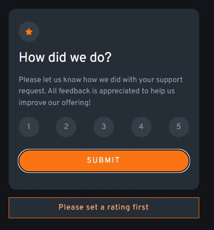

# Frontend Mentor - Interactive rating component solution

This is a solution to the [Interactive rating component challenge on Frontend Mentor](https://www.frontendmentor.io/challenges/interactive-rating-component-koxpeBUmI). Frontend Mentor challenges help you improve your coding skills by building realistic projects.

## Overview

### The challenge

Users should be able to:

- View the optimal layout for the app depending on their device's screen size
- See hover states for all interactive elements on the page
- Select and submit a number rating
- See the "Thank you" card state after submitting a rating

### Screenshot

### Links

- Solution URL: [repo](https://github.com/dowely/interactive-rating-component)
- Live Site URL: [GitHub Pages](https://dowely.github.io/interactive-rating-component/)

## My process

### Built with

- TypeScript
- SASS
- Vue
- Webpack

### What I learned

How to set up a project with the above tech stack.

## Author

- Website - [Marcin Ogar](https://dowely-nba-react-app.netlify.app/about)
- Frontend Mentor - [@dowely](https://www.frontendmentor.io/profile/dowely)
